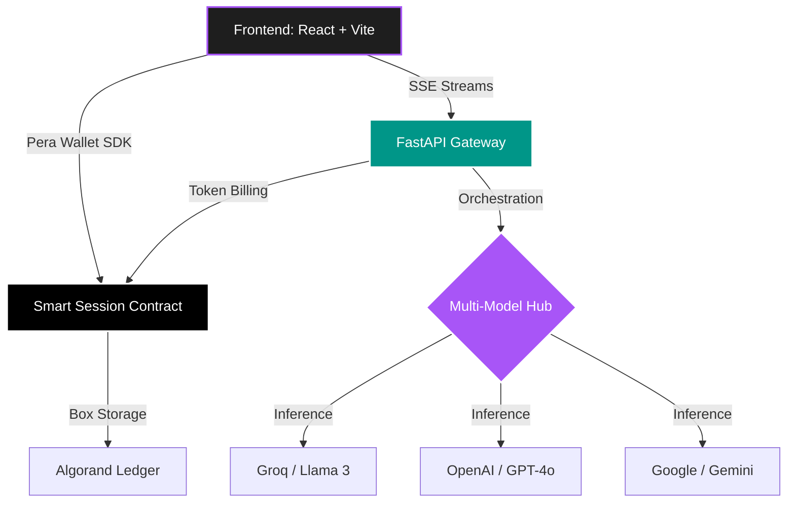

<div align="center">
  
  <h1 align="center">🚀 PayPerAI</h1>
  
  <p align="center">
    <b>The Future of Blockchain-Gated AI, One-Click NFT Generation & Custom AI Agent Marketplaces</b>
  </p>

  <p align="center">
    <a href="https://developer.algorand.org/">
      
    </a>
    <a href="https://react.dev/">
      
    </a>
    <a href="https://fastapi.tiangolo.com/">
      
    </a>
    <a href="https://openai.com/">
      
    </a>
  </p>

  <p align="center">
    
  </p>
</div>

---

## 📑 Table of Contents

1. [Project Overview](#-1-project-overview)
2. [Key Features](#-2-key-features)
3. [Quick Start (5 Mins)](#-3-quick-start-5-mins)
4. [System Architecture](#-4-system-architecture)
5. [Configuration & Setup](#-5-configuration-setup)
6. [QR Verification System](#-6-qr-verification-system)
7. [Deployment Guide](#-7-deployment-guide)
8. [Troubleshooting](#-8-troubleshooting)

---

## 📂 Deep-Dive Documentation Index

Explore our high-fidelity, comprehensive guides for setup, security specifications, and smart contracts:

* 🛠️ **[Repo Setup Guide](docs/repo_setup_guide.md)** — Step-by-step local setup, environment configurations, and Vercel routing parameters.
* 🧠 **[System Architecture Document](docs/architecture_doc.md)** — Architectural sequence diagrams, secure AES-256 BYOK model, and real-time SSE streaming details.
* ⛓️ **[Smart Contract Specifications](docs/smart_contract_docs.md)** — PyTeal deployment specifications, global states, and Box Map escrow allocations on Algorand Testnet.

---

## 📖 1. Project Overview

**PayPerAI** is a state-of-the-art decentralized platform bridging the gap between premium AI models and Web3 finance. We solve the issue of bloated monthly AI subscriptions by introducing a frictionless **Pay-Per-Use** model powered by the **Algorand Blockchain**. 

Users connect their wallets, authorize a smart contract session, and get instantly charged *only for the exact tokens they consume*. No credit cards. No lock-ins. Switch between world-class models like Llama 3, GPT-4o, and Gemini 1.5 in a single conversation.

### 📊 The Subscription Crisis: Why We Need X402 Pay-Per-Use

Traditional monthly subscriptions are highly inefficient, resulting in massive financial waste. PayPerAI replaces fixed fee models with direct on-chain utility.

<div align="center">

| 🛑 The Problem: Subscription Bloat | ⚡ The Cure: X402 Pay-Per-Use |
| --- | --- |
| **82%** of active users consume < 15% of monthly prompt quotas | Billed dynamically for exact token ingress + egress |
| **$20/mo** flat tax paid to centralized AI companies | Average query costs under **0.005 ALGO ($0.001)** |
| **54%** of annual SaaS seats go completely under-utilized | Zero lock-ins, zero monthly invoices, 100% self-custodial |
| Multi-subscription friction (switching between ChatGPT & Claude) | **Multi-Model Swapping** in a single workspace session |

</div>

### 📈 Core Market Statistics:
> [!IMPORTANT]
> According to recent SaaS usage studies:
> * 👥 **89% of Developers** prefer direct pay-per-token API structures over fixed monthly accounts.
> * 💸 **Over $180/year** is wasted by the average consumer on under-utilized AI subscriptions.

### 💡 Why PayPerAI Matters

PayPerAI introduces a groundbreaking shift in how we access, secure, and monetize artificial intelligence:

* **👥 For Consumers (Stop Monthly Waste):** Avoid flat-rate monthly AI subscriptions that charge you regardless of usage. Pay only for the exact tokens you consume, with average prompt costs under $0.001!
* **💻 For Developers (DeFi API Sharing):** If you have an API key that you don’t use often, you can securely plug it into our marketplace, host custom agents, and generate instant, cash-flowing passive income when others use your idle quotas.
* **🔒 For Creators (Secure BYOK):** Retain absolute ownership of your credentials. Using our AES-256-GCM secure Bring Your Own Key (BYOK) manager, your keys are encrypted on-chain and only decrypted inside volatile RAM during active executions—guaranteeing complete sovereignty.

---

## ✨ 2. Key Features

### Core Capabilities
* **🧠 Multi-Model Intelligence**: Switch seamlessly between **Llama 3.3 (Groq)**, **GPT-4o Mini**, **Gemini 1.5 Flash**, and **Qwen 2.5**. Change models mid-conversation without losing your chat context—the ultimate playground for power users.
* **⚡ Seamless Real-Time Streaming**: Ultra-fast, character-by-character responses powered by Server-Sent Events (SSE). Experience Web2 performance with Web3 security as on-chain deductions happen in the background.
* **⏱️ Pro Smart Sessions**: Authorize once, chat forever. Our optimized Smart Sessions use a **1 ALGO buffer** to enable "unlimited" prompting for 24 hours. No manual approval for every message—just pure, uninterrupted flow.
* **💎 1-Click NFT Minting**: Transform your AI interactions and images into permanent on-chain ARC-69 assets with one click. Delivered instantly to your Pera Wallet as an immutable proof of creation.
* **🛒 Custom AI Agent Marketplace**: Host custom, secure AI agents with unique prompts and private BYOK keys. Monetize idle API keys by allowing others to run queries, earning dynamic pay-per-token royalty splits (90% creator / 10% platform) secured directly by the Algorand ledger.

### 🚀 Latest Platform Upgrades (May 2026)
1. **100% SEO Compliance & Rich Snippets:** Advanced JSON-LD Schema Markup, social Open Graph (OG) taggings, Twitter Cards, and canonical routing links integrated.
2. **Search Console Verification & Crawling:** Static crawler asset verification, XML Sitemaps, and strict crawler pathing directives configured.
3. **Dynamic Token-Based Billing:** Granular token invoicing billed directly in MicroAlgos, coupled with an active Escrow Buffer Guard preventing mid-query failures.
4. **Smart Settlement & Provider Optimizations:** Restructured Google Gemini streaming and patched Box allocation sizes on the Algorand Smart Contract settlement flows.
5. **Decentralized Custom AI Agent Marketplace:** Personalized agent creation, creator profile directories, secure BYOK (Bring Your Own Key) credential encryption, and automatic contract-enforced creator split payouts (90% creator / 10% platform).

---

## 🚦 3. Quick Start (5 Mins)

### Live Demo Deployments
> 🔗 **Live Frontend:** **[https://pay-per-use-ai.vercel.app/](https://pay-per-use-ai.vercel.app/)**  
> 🔗 **Live Backend API:** **[https://pay-per-use-ai.onrender.com/docs](https://pay-per-use-ai.onrender.com/docs)**  
> 
> *No local setup required. Optimized for Algorand TestNet.*

### Run Locally in 3 Steps
1. **Clone the Repo:**
   ```bash
   git clone https://github.com/WPrasad99/Pay-Per-Use-Ai.git
   cd Pay-Per-Use-Ai
   ```
2. **Run Backend (FastAPI):**
   ```bash
   cd backend
   python -m venv venv
   source venv/bin/activate  # Or .\venv\Scripts\activate on Windows
   pip install -r requirements.txt
   uvicorn app.main:app --reload --port 8000
   ```
3. **Run Frontend (Vite + React):**
   ```bash
   cd ../frontend
   npm install
   npm run dev
   ```
   Open `http://localhost:5173` in your browser.

---

## 🧠 4. System Architecture

For a deep dive into sequence interaction pathways and state flow mechanics, refer to our comprehensive **[System Architecture Document](docs/architecture_doc.md)**.

### Hybrid Multi-Model Chat Engine
Unlike other platforms that lock you into one model per page, PayPerAI allows you to **change the model on-the-fly**. You can start a conversation with Llama 3 for speed and switch to GPT-4o for complex logic—all within the same persistent thread.

### High-Performance Smart Sessions (ARC-0060)
We've optimized the Algorand Smart Session model for maximum UX:
* **Balance-Aware Authorization:** Sessions authorize your entire available escrow balance, preventing "out of session funds" errors.
* **Manual Control:** "End Session" functionality gives users complete control to instantly claim their locked Algos back to their wallet.
* **Auto-Sync History:** A unified history system that tracks your intelligence usage across every model.

### Platform Data Flow


---

## ⚙️ 5. Configuration & Setup

For step-by-step setup guides, package dependencies, database migrations, and detailed explanation of environment flags, view our dedicated **[Repo Setup Guide](docs/repo_setup_guide.md)**.

### Tech Stack Specifications

<div align="center">
  
</div>

#### 💻 Programming Languages & Standards
* **Python (3.10+):** Drives the low-latency asynchronous API Gateway orchestration.
* **JavaScript (ES6+):** Orchestrates state logic, persistent messaging, and wallet triggers in the client interface.
* **PyTeal / TEAL:** Governs the compile scripts and logic verification assertions for our Algorand BoxMap smart escrow contract.
* **W3C DID Standard:** Implements verifiable, decentralized credentials (`did:payperai:<wallet>`) and cryptographic SHA-256 state hashing.

#### 🧰 Blockchain SDKs & Protocol Libraries
* **`@perawallet/connect` (JS SDK v1.0+):** Establishes secure dynamic QR challenges and signs atomic transaction groups directly inside the browser.
* **`algosdk` (Python & JavaScript):** Assembles raw ledger transaction packets, calculates Box storage fee minimums, and handles real-time indexer query decodings.
* **ARC-0060 (Smart Sessions):** Implements dynamic, balance-aware transaction authorization logic for micro-deductions.
* **ARC-0069 (NFT Metadata):** Integrates 1-click on-chain NFT minting parameters including creator profiles, royalty values, and secure media links.

#### ⚙️ Backend Frameworks & Database Layer
* **FastAPI:** Asynchronous Python gateway optimized for low-latency concurrent requests.
* **Uvicorn:** High-performance ASGI web server hosting backend API endpoints.
* **PostgreSQL:** Production-grade relational database storing user profile analytics, creator configurations, and conversation logs.
* **asyncpg / SQLAlchemy:** Dynamic asynchronous database connectors ensuring high-speed indexing and query execution.

#### 🎨 Frontend Frameworks & Client Libraries
* **React (v18):** Powering our ultra-responsive client dashboard and custom agent workspace.
* **Vite:** High-speed bundler enabling rapid development hot module reloading (HMR).
* **Tailwind CSS & Vanilla CSS:** Custom custom neo-brutalist dark-themed design system.
* **Server-Sent Events (SSE):** Native streaming listener displaying AI output character-by-character.

#### 🧠 Artificial Intelligence SDKs & APIs
* **Groq Cloud SDK:** Drives high-speed **Llama 3.3** and **Qwen 2.5** inference queries.
* **OpenAI Python SDK:** Connects and orchestrates **GPT-4o Mini** queries.
* **Google Generative AI SDK:** Integrates low-latency streaming endpoints for **Gemini 1.5 Flash**.

---

## 🔍 6. QR Verification System

### dynamic Web3 Wallet Connect Challenges
Pay-Per-Use-AI features a decentralized **QR Verification System** utilizing the Pera Wallet Connect SDK to securely authenticate consumer sessions.

```text
  Desktop Browser        Dynamically Generated QR        Pera Mobile App
 ┌───────────────┐        ┌─────────────────────┐        ┌───────────────┐
 │               │        │  █▀▀▀█  █▄▀  █▀▀▀█  │        │   Scan &      │
 │  Click Start  │ ─────► │  █ ▀ █  ▀▀▄  █ ▀ █  │ ─────► │   Sign        │
 │  AI Session   │        │  ▀▀▀▀▀  ▀ ▀  ▀▀▀▀▀  │        │   On-Chain    │
 │               │        └─────────────────────┘        │   Escrow      │
 └───────────────┘                                       └───────────────┘
```

* **Dynamic Desktop Connection:** When a desktop user initializes their workspace dashboard session, the frontend requests a secure session challenge from the Pera Wallet Bridge. Pera Wallet dynamically generates a localized, cryptographically unique QR verification code.
* **Mobile Sign-off Integration:** The consumer scans the QR verification code using their mobile Pera Wallet app. This establishes a secure, end-to-end encrypted connection between their browser session and mobile wallet.
* **One-Click On-Chain Escrow:** Once scanned, the user is prompted on-device to sign the 1 ALGO escrow transaction. Pera signs the transaction securely on the hardware, submits it to the Algorand Testnet, and broadcasts the validated transaction hash back to the frontend to instantly unlock frictionless chat.

---

## 🌐 7. Deployment Guide

To check deployment compiling instructions, smart contract deployment commands, global/local state maps, and ABI actions, read our **[Smart Contract Specifications](docs/smart_contract_docs.md)**.

### Vercel Routing Configuration
We have deployed the React client workspace to Vercel. To prevent `404` errors when reloading deep router paths (such as `/dashboard`, `/creator/*`, or `/shared/*`), the deployment includes a root `vercel.json` file to rewrite all client requests back to the master index page:

```json
{
  "cleanUrls": true,
  "trailingSlash": false,
  "rewrites": [
    {
      "source": "/(.*)",
      "destination": "/index.html"
    }
  ]
}
```

---

## 🛠️ 8. Troubleshooting

### 1. Direct Page Reloading Returns "404 Not Found" on Vercel
* **Cause:** Single-Page Applications (SPAs) route pages client-side. Refreshing directly asks the host server for a folder structure that does not exist.
* **Fix:** Ensure a root [vercel.json](file:///c:/Users/Prasad/Desktop/Pay-Per-Use-Ai/Pay-Per-Use-Ai/vercel.json) file containing routing rewrites exists in your repository root, then redeploy.

### 2. "SESSION_EXPIRED" or "NO_SESSION" Chat Prompts
* **Cause:** Your Algorand 24-hour smart session has expired, or the locked Algos in your Box escrow have been fully spent.
* **Fix:** Simply click the session status indicator in the top header or prompt a chat message to dynamically trigger the **Pera Wallet Escrow Recharge Challenge**. Re-sign to top up your session balance, and your chat context will resume immediately.

### 3. Pera Wallet Connection Mismatches
* **Cause:** Active session storage caching outdated wallet connection data.
* **Fix:** Click "Logout" in the sidebar, disconnect your account in your mobile Pera Wallet app, reload the webpage, and scan the QR verification code again to establish a fresh bridge.
