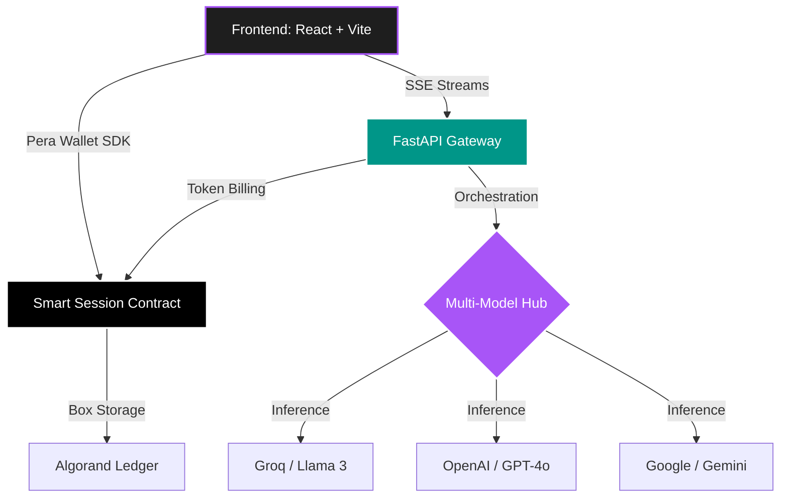

<div align="center">
  
  <h1 align="center">🚀 PayPerAI</h1>
  
  <p align="center">
    <b>The Future of Blockchain-Gated AI & One-Click NFT Generation</b>
  </p>

  <p align="center">
    <a href="https://developer.algorand.org/">
      
    </a>
    <a href="https://react.dev/">
      
    </a>
    <a href="https://fastapi.tiangolo.com/">
      
    </a>
    <a href="https://openai.com/">
      
    </a>
  </p>

  <p align="center">
    
  </p>
</div>

<br />

## 📖 About The Project

**PayPerAI** is a state-of-the-art decentralized platform bridging the gap between premium AI models and Web3 finance. We solve the issue of bloated monthly AI subscriptions by introducing a frictionless **Pay-Per-Use** model powered by the **Algorand Blockchain**. 

Users connect their wallets, authorize a smart contract session, and get instantly charged *only for the exact tokens they consume*. No credit cards. No lock-ins. Switch between world-class models like Llama 3, GPT-4o, and Gemini 1.5 in a single conversation.

---

## ✨ Features That Make Us G.O.A.T. 🐐

<table align="center">
  <tr>
    <td width="50%">
      <h3>🧠 Multi-Model Intelligence</h3>
      <p>Switch seamlessly between <b>Llama 3.3 (Groq)</b>, <b>GPT-4o Mini</b>, <b>Gemini 1.5 Flash</b>, and <b>Qwen 2.5</b>. Change models mid-conversation without losing your chat context—the ultimate playground for power users.</p>
    </td>
    <td width="50%">
      <h3>⚡ Seamless Real-Time Streaming</h3>
      <p>Ultra-fast, character-by-character responses powered by Server-Sent Events (SSE). Experience Web2 performance with Web3 security as on-chain deductions happen in the background.</p>
    </td>
  </tr>
  <tr>
    <td width="50%">
      <h3>⏱️ Pro Smart Sessions</h3>
      <p>Authorize once, chat forever. Our optimized Smart Sessions use a <b>1 ALGO buffer</b> to enable "unlimited" prompting for 24 hours. No manual approval for every message—just pure, uninterrupted flow.</p>
    </td>
    <td width="50%">
      <h3>💎 1-Click NFT Minting</h3>
      <p>Transform your AI interactions and images into permanent on-chain ARC-69 assets with one click. Delivered instantly to your Pera Wallet as an immutable proof of creation.</p>
    </td>
  </tr>
</table>

---

## 🚦 Live Demo & Quick Start

> 🔗 **Live Frontend:** **[https://pay-per-use-ai.vercel.app/](https://pay-per-use-ai.vercel.app/)**
> 🔗 **Live Backend API:** **[https://pay-per-use-ai.onrender.com/docs](https://pay-per-use-ai.onrender.com/docs)**
> 
> *No local setup required. Optimized for Algorand TestNet.*

---

## 📈 Latest Platform Updates (May 2026)

We have recently upgraded the platform infrastructure with major enhancements in billing, performance, search discoverability, and SEO:

### 1. 100% SEO Compliance & Rich Snippets
- **JSON-LD Schema Markup:** Embedded advanced structured data (`SoftwareApplication` schema) inside the frontend index to enable rich Google search snippets, sitelinks, and professional application ratings.
- **Social Integration Cards:** Configured standard **Open Graph (OG)** parameters and **Twitter Cards** (`summary_large_image`) for rich social sharing previews on Discord, Slack, LinkedIn, and X/Twitter.
- **Canonical Routing:** Anchored production page paths with a `<link rel="canonical" href="https://pay-per-use-ai.vercel.app/" />` tag to build domain authority.

### 2. Search Console Verification & Crawling
- **Google Site Verification:** Added [google7b530e97713f5fc8.html](file:///c:/Users/Prasad/Desktop/Pay-Per-Use-Ai/Pay-Per-Use-Ai/frontend/public/google7b530e97713f5fc8.html) into static assets to verify domain ownership instantly in Search Console.
- **XML Sitemap & robots.txt**: Generated [sitemap.xml](file:///c:/Users/Prasad/Desktop/Pay-Per-Use-Ai/Pay-Per-Use-Ai/frontend/public/sitemap.xml) and [robots.txt](file:///c:/Users/Prasad/Desktop/Pay-Per-Use-Ai/Pay-Per-Use-Ai/frontend/public/robots.txt) directly in the static serving folder to direct crawler spiders to index public paths (Home, Onboarding, Marketplace, and Creator profiles) while shielding private user dashboards.

### 3. Dynamic Token-Based Billing
- **Granular Token Invoicing:** Transitioned from flat per-use rates to **dynamic token-based micro-payments** billed in MicroAlgos, ensuring users only pay for exact token consumption (input + output).
- **Escrow Buffer Guard:** Implemented live session balance verification to prompt users to recharge before hitting transaction limits, preventing failed middleman execution.

### 4. Smart Settlement & Provider Optimizations
- **Gemini 1.5 Streaming Fixes:** Fully resolved streaming timeouts and 404 response errors for Google Gemini models, securing reliable Server-Sent Events (SSE).
- **Box Allocation Fixes:** Fixed box access constraints (`box_len` assertions) on the Algorand Smart Contract settlement flows.

### 5. Decentralized Custom AI Agent Marketplace
- **Custom Agent Creator Engine:** Enabled creators to design, name, configure custom system instructions/prompts, and deploy personalized AI agents with secure model configurations.
- **Algorand Creator Profiles:** Integrated decentralized profiles (`/creator/:wallet`) linked with Pera Wallet, letting creators display their catalog, track agent usage, and capture creator dashboard analytics.
- **Secure BYOK (Bring Your Own Key) Workflows:** Streamlined the agent creation workflow with a highly secure Bring Your Own Key (BYOK) manager, resolving external quota/rate limits and ensuring fresh session setups.
- **Decentralized Revenue Splits:** Backed custom agent runs by blockchain smart contracts that automatically enforce payout splits between the agent creator and the platform host on every token execution.

---

## 🚀 Architectural Innovations

### 1. Hybrid Multi-Model Chat Engine
Unlike other platforms that lock you into one model per page, PayPerAI allows you to **change the model on-the-fly**. You can start a conversation with Llama 3 for speed and switch to GPT-4o for complex logic—all within the same persistent thread.

### 2. High-Performance Smart Sessions (ARC-0060)
We've optimized the Algorand Smart Session model for maximum UX:
- **Balance-Aware Authorization:** Sessions now authorize your entire available escrow balance, preventing "out of session funds" errors during deep research.
- **Manual Control:** New "End Session" functionality gives users complete control over their on-chain session state.
- **Auto-Sync History:** A unified history system that tracks your intelligence usage across every model you interact with.

### 3. Neo-Brutalism Workspace
A premium, state-of-the-art UI designed for the modern developer:
- **Clean Sidebar:** Deduplicated model lists for a focused experience.
- **Interactive Header:** Live session countdowns and status indicators.
- **Dynamic Quick Prompts:** Start your session with pre-configured expert templates.

---

## 🎯 User Workflow (The Magic Flow)

```text
┌──────────────────────────────────────────────────────────────────┐
│  1. CONNECT  →  Connect Pera Wallet (TestNet)                    │
│  2. DEPOSIT  →  Add a small ALGO buffer to your smart escrow     │
│  3. APPROVE  →  Sign ONCE for an unlimited 24h smart session     │
│  4. CHAT     →  Stream responses from GPT, Llama, or Gemini      │
│  5. SWITCH   →  Change models mid-chat to get the best answer    │
│  6. MINT     →  Save your AI masterpieces as on-chain NFTs       │
└──────────────────────────────────────────────────────────────────┘
```

---

## 🧱 Architecture Diagram



---

## 💻 Tech Stack

<div align="center">
  
</div>

| Layer               | Technology                               | Key Features                                                  |
| ------------------- | ---------------------------------------- | ------------------------------------------------------------- |
| **Blockchain**      | Algorand (ARC-0060)                      | Smart Sessions, BoxMap Escrow, Atomic Groups                  |
| **AI Backend**      | FastAPI + Groq + OpenAI                  | Low-latency streaming, Token-based billing                    |
| **Frontend**        | React 18 + Neo-Brutalism CSS             | Multi-model switcher, Session management UI                   |
| **Infrastructure**  | Docker + PostgreSQL                      | Scalable message history & User analytics                     |

---

<div align="center">
  
  <h2>🚀 <b>Team PayPerAI</b> 🚀</h2>
  <p><i>Building the decentralized future of AI economies.</i></p>
  <br/>
  <a href="https://github.com/WPrasad99/Pay-Per-Use-Ai">
    
  </a>
</div>
