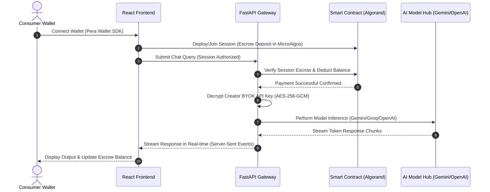

# 🧠 Pay-Per-Use-AI: System Architecture Document

This document traces the technical design and data flows of the Pay-Per-Use-AI platform, illustrating how we integrate Web3 Algorand micro-transactions with high-performance real-time AI model orchestration.

---

## 🏛️ 1. High-Level Architectural Diagram

The system comprises three core layers: **Client Frontend (React)**, **FastAPI Orchestration Gateway**, and the **Algorand Testnet Ledger**, interacting in a hybrid layout.



---

## 🔐 2. Secure BYOK (Bring Your Own Key) Cryptography

To circumvent rate limiting and ensure self-sovereignty, Pay-Per-Use-AI employs a **Bring Your Own Key (BYOK)** structure. 

### Key Encryption Workflow (AES-256-GCM)
1. **Creation**: The Creator enters their display credentials and pastes their raw API Key inside the unified **Identity** step.
2. **Encryption**: The React client securely posts the key to the backend. The backend encrypts the key using standard **AES-256-GCM** encryption with the platform's canonical `API_KEY_ENCRYPTION_SECRET`.
3. **Decentralized Storage**: The encrypted key (ciphertext, nonce, and tag) is serialized and stored on-chain linked to the creator's wallet.
4. **Execution Decryption**: When a consumer initializes an AI session with this creator's agent, the backend pulls the encrypted string from the ledger, decrypts it on-the-fly inside RAM, executes the model query, and immediately discards the raw key, preventing it from ever being cached on disk or logged.

```text
  Raw API Key ──► [ Backend RAM ] ──► Encrypt (AES-256-GCM) ──► Encrypted String
                        ▲                                           │
                        │                                           ▼
                  Platform Secret                              Saved On-Chain
```

---

## ⚡ 3. Real-Time SSE (Server-Sent Events) Chat Hub

Rather than using long-polling or bulky WebSockets, our system delivers character-by-character responses with ultra-low latency using **Server-Sent Events (SSE)**.

### Performance Pipeline
* **Pipelined Authentication**: The backend acts as a streaming gateway. The moment the API query is submitted, it validates the caller's smart session escrow buffer.
* **Non-Blocking Inference Chunks**: As the foundation model returns token chunks (e.g. Gemini 2.0 Flash or GPT-4o), they are instantly serialized into standard `text/event-stream` chunks.
* **On-Chain Settlement**: Once the stream concludes, the exact token count consumed (input + output) is computed. The backend executes a settlement transaction on the Algorand smart contract, deducting the exact token cost from the user's session escrow.

---

## 💰 4. Session Escrow Buffers (Uninterrupted UX)

Traditional blockchain applications require a wallet signature for every single message, which completely destroys the chat user experience. 

Pay-Per-Use-AI introduces **High-Performance Smart Sessions**:
* **The 1 ALGO Escrow Buffer**: Upon starting a session, the user signs **once** via Pera Wallet to lock a 1 ALGO buffer inside the contract's secure BoxMap escrow.
* **Frictionless Prompts**: For the next 24 hours, the user can prompt the AI continuously without ever seeing another wallet signature popup!
* **Transparent Settlement**: The backend calculates the MicroAlgo token costs in the background and settles them directly against the session escrow.
* **Self-Governed Release**: The user can click "End Session" at any time, returning any unspent escrow balance back to their wallet instantly.
